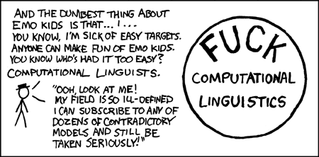

<!-- smaller: true -->

```{r setup, echo=FALSE}
knitr::opts_chunk$set(echo=FALSE, eval=TRUE)
```

## logistics

- most of today will be live demos
- clone this repository to follow along: INSERT-LINK
- you'll need a recent version of R and the following packages (use `install.packages()`):
    - blah
    - blah


# outline 

## outline 

1. overview of NLP (10-15min)
    - what is natural language processing?
    - common tasks, algorithms, and models
    - modern tools
2. NLP at NORC (5min)
    - HMC
    - what else? 
3. live demos (40min)
    - data structures and n-grams 
    - sentiment analysis 
    - word-embeddings 


# 1. overview of the field of NLP

## what is natural language processing?

### disclaimer: no universally accepted definition! 

<br>

```{r, out.width="800px", fig.align="center"}

```


## what is natural language processing? (a linguist's take)

two branches of **computational linguistics**:

- symbolic computational linguistics: using computers to construct and evaluate **discrete** models of language structure and meaning -- the goal is to **understand** and **represent** human language 
- statistical computational linguistics: using computers to **learn** what actual language use is like by exposing them to **statistical regularities** that are present in **large, naturally-occurring corpora** 

> I think of Natural Language Processing as basically synonymous with "statistical computational linguistics"
 


## what is natural language processing?

high-level distinction between **NLU** and **NLG**

- **Natural language understanding (NLU)**: INSERT-DEFN
- **Natural language generation (NLG)**: INSERT-DEFN

Usually when people talk about "natural language processing" they are talking about NLU. And more specifically, NLU **on text data** (i.e. not audio)

We'll focus on text-based NLU today 


## what is natural language processing?

easier to define NLP in terms of *tasks* and *objectives* than an abstract characterization 

there are usually at least the following broad phases in an NLP project life cycle:

1. data acquisition: define and obtain or construct your corpus 
2. preprocessing: regularize text; remove stop words and other junk; transform corpus into a format you can compute on; calculate some summary statistics do be used downstream (e.g. number of unique words, total word count)
3. model development: define your objective; select an algorithm that will generate predictions you can use to measure how well you are fulfilling your objective; set aside a subset of your data ($\approx$20-30%) for evaluation
4. model evaluation + selection: define a success metric (e.g. accuracy relative to human labels or some benchmark dataset)
5. model "deployment:" use your model to generate predictions on unseen text. 


## NLP tasks (preprocessing)

important text-based NLU **preprocessing** tasks:

- tokenization (break up a corpus into words, phrases, sentences, etc.)
- lemmatization/stemming (reduce morphological variants to a common form, e.g. *running*/*ran*/*runs* $\Longrightarrow$ *run*)
- part-of-speech tagging (associate each token with a category like "noun", "verb", "preposition", etc.)
- parsing (turn raw text into a representation that approximates each sentence's internal structure)


## NLP tasks (modeling)

some common tasks, which can be approached with supervised or unsupervised methods:

better list:
  - doc clf
  - sent anal
  - named ent rec
  - depend pars

hi-level tasks are broken down into discrete subtasks, e.g.

dependency parsing:
  - tokenization
  - lemmatization/stemming
  - pos tagging
  - build parse trees


- document classification (e.g. spam filtering, topic detection)
- information retrieval (e.g. google's page rank)
- machine translation (e.g. google translate)
- document clustering (e.g. LDA-based topic models)
- sentiment analysis (e.g. dictionary-based models)


## NLP tasks (supervised/unsupervised)

NLP tasks can be divided into **supervised** tasks and **unsupervised** tasks

### supervised tasks...

- usually start with some human-labeled training data (e.g. "related to tobacco/smoking"/"not related to tobacco/smoking") -- setting aside ~25% for model evaluation 
- define some ... 
- FINISH THIS 


### unsupervised tasks...

- categorize or score bodies of text w/o human-labeled examples
- often a given objective can be approached with supervised or unsupervised methods (e.g. sentiment analysis)
- FINISH THIS 


## NLP tasks (general strategy/workflow)

- usually the unit of information in an NLP task is the "**document**" (e.g. a tweet or a webpage or an Amazon product review)
- a dataset is a set of documents, aka a **corpus**
- the name of the game is usually: 
    - do some preprocessing on the corpus (e.g. lowecasing, lemmatization); 
    - transform the corpus into a numerical matrix of some kind (e.g. DTM, TCM); 
    - do a bunch of linear algebra over that matrix until you can either make the predictions you need to make, or view a visualization of the clustering you need to understand; and 
    - evaluate your model's predictions on the test/holdout set against the human labels


# 2. modern tooling for NLP 


## caveat 

- most NLP tasks are *extremely computationally expensive* (we'll see examples later)
- high-level languages like Python and R are great for exploring data and deploying small- to medium-scale models
- but when speed is crucial (e.g. question-answering), models are usually implemented in lower-level languages like Java or C++ (e.g. `word2vec` is implemented in C++; `GloVe` is implemented in Java)

Today we'll just look at modern tooling for Python and R

## Python or R? 

- as of 2018, the NLP ecosystem is much more mature in Python than in R
- R's memory management system makes it less than ideal for large-scale text analysis endeavors
- **BUT** recent NLP packages for R are `Rcpp::`-based extensions, and thus can overcome some of R's limitations (especially if you are using a high-performance machine with tons of RAM) 

My workflow is usually the following:

- use R to get a feel for the data (visualization, summary statistics) 
- use Python to implement the model and apply it to the corpus (writing predictions to a file)
- use R to evaluate model performance, visualize, and report results (`.Rmd`/`ggplot2::`)

**NOTE**: if you haven't yet, check out R Studio's new `reticulate::` package!


## Python NLP tools 

#### NLTK
- tried and true
- contains lots of corpora and datasets
- implements symbolic and statistical models (unique in this respect)
- not necessarily optimized for modern workflows

#### gensim
- implements bleeding edge models
- fast and efficient 

#### spacy
- nice API, easy to use, fast
- out of the box, *stuff just works*
- not super flexible

#### sklearn
- there are a few `sklearn` models designed for text
- they use the familiar `sklearn` API
- a good starting point
- excellent for preprocessing
- EXAMPLES


## R NLP tools 

#### text2vec (still in beta!)
- my favorite R package for NLP: fast and clean and not bloated
- implements `GloVe` and `word2vec` in R/C++ 
- main goal is to provide an interface for training term embeddings
- but also provides very nice `R6::` classes for important data structures like DTM's and TCM's


#### quanteda 
- a modern end-to-end framework for working with text data
- has a nice interface and seems like decent performance, but hasn't gained a lot of traction in the R community

#### tidytext
- an excellent package for learning NLP, especially when combined with `dplyr::` and [Robinson & Silge (2016)](INSERT-LINK)
- slow and therefore not a good choice for production-grade models


#### tm
- an older framework -- I haven't used it much (anyone??)

```{r}
lefftpack::dataset_word_freq
```


# NLP at NORC 

## NLP at NORC 

- almost all HMC projects involve at least one NLP task
    - "theme" identification is a document classification problem; 
    - sentiment analysis
    - ...

- I'm not aware of any other current projects that use text analysis -- anyone know of any?!


# demos, demos, demos! 

## the rest of today: 

- demo 1: BLAH
- demo 2: BLAH
- demo 3: BLAH


# demo 1: spam filter

## demo 1: spam filter 

- use UCI spam dataset (5572 messages labeled as either ham or spam)
- 

```{python}
import random
import pandas as pd

from sklearn import metrics
from sklearn.naive_bayes import MultinomialNB
from sklearn.feature_extraction.text import CountVectorizer


### read in data and reorganize a bit 
spam_data = '../sample_datasets/spam_clf/uci_ml_spam.txt'
dat = pd.read_csv(spam_data, names=['ham_spam', 'text'], sep='\t')

dat['label'] = dat.ham_spam == 'spam'
dat = dat[['ham_spam', 'label', 'text']]


# inspect the dataset 
# print(dat.head(5))
# print(dat.shape)
# dat.ham_spam.value_counts() # / sum(dat.ham_spam.value_counts())


### test-train split 
train_idx = random.sample(range(len(dat)), int(len(dat)*.75))
test_idx = [n for n in set(range(len(dat))) - set(train_idx)]

train_text = list(dat.text.iloc[train_idx])
train_labs = list(dat.label.iloc[train_idx])

test_text = list(dat.text.iloc[test_idx])
test_labs = list(dat.label.iloc[test_idx])


### preprocess text (cast to a count-based document-term matrix)
vectorizer = CountVectorizer(lowercase=True, ngram_range=(1,1), 
                             stop_words='english')
train_dtm = vectorizer.fit_transform(train_text)

# check out the transformed data 
# vectorizer.get_feature_names()[999:1011]
# list(vectorizer.get_stop_words())[0:10]
# vectorizer.get_params()
# pd.DataFrame(train_dtm.A, columns=vectorizer.get_feature_names()).to_string())


# model training 
clf = MultinomialNB()
clf.fit(train_dtm, train_labs)

# model evaluation 
test_dtm = vectorizer.transform(test_text)

predictions = clf.predict(test_dtm)

accuracy = metrics.accuracy_score(test_labs, predictions)
print(f'out of the box accuracy: {round(accuracy,3)}')

evaluation_df = pd.DataFrame([*zip(test_labs, predictions, test_text)], 
                             columns=('label', 'prediction', 'text'))

# look at the bad predictions 
print(evaluation_df[evaluation_df.label != evaluation_df.prediction])

# can also add `margins=True` 
conf_mat = pd.crosstab(evaluation_df.label, evaluation_df.prediction, 
                       rownames=['observed'], colnames=['predicted'])

print(conf_mat)

# if you want to see column-normalized cells 
# print(round(conf_mat / conf_mat.sum(axis=0), 3))


```


# demo 2: data structures 


# demo 3: word embeddings 


# demo 2: 


<link rel="stylesheet" type="text/css" href="http://fonts.googleapis.com/css?family=Inconsolata">
<link rel="stylesheet" type="text/css" href="http://fonts.googleapis.com/css?family=Montserrat">
<style>

pre {
  font-size: 12pt;
  width: auto;
  margin: auto;
  margin-left: 60px;
  font-family: 'Inconsolata', monospace !important;
  background-color: #f2f2f2;
  border: 1px lightgray solid;
  border-radius: 4px;
  padding: 4px;
}
code {
  font-size: 12pt;
  font-family: 'Inconsolata', monospace !important;
}
table {
  width: 75% !important;
  margin: auto;
}

<!-- /* vertical-align: center !important; */ -->
.title-slide hgroup h1 {
  font-size: 48px;
  
}

<!-- /* ugh this is supposed to put small logo on subsequent slides but didnt */  -->
<!-- slides > slide:not(.nobackground):before { -->
<!--   width: 222px; -->
<!--   height: 54.5px; -->
<!--   background-size: 250px 75px; -->
<!-- } -->


</style>


nlp is less of a unified field with an established theoretical tradition than it is an amalgamation of approaches to tasks that are derived from theoretical constructs from computer science, linguistics, and information theory. 

